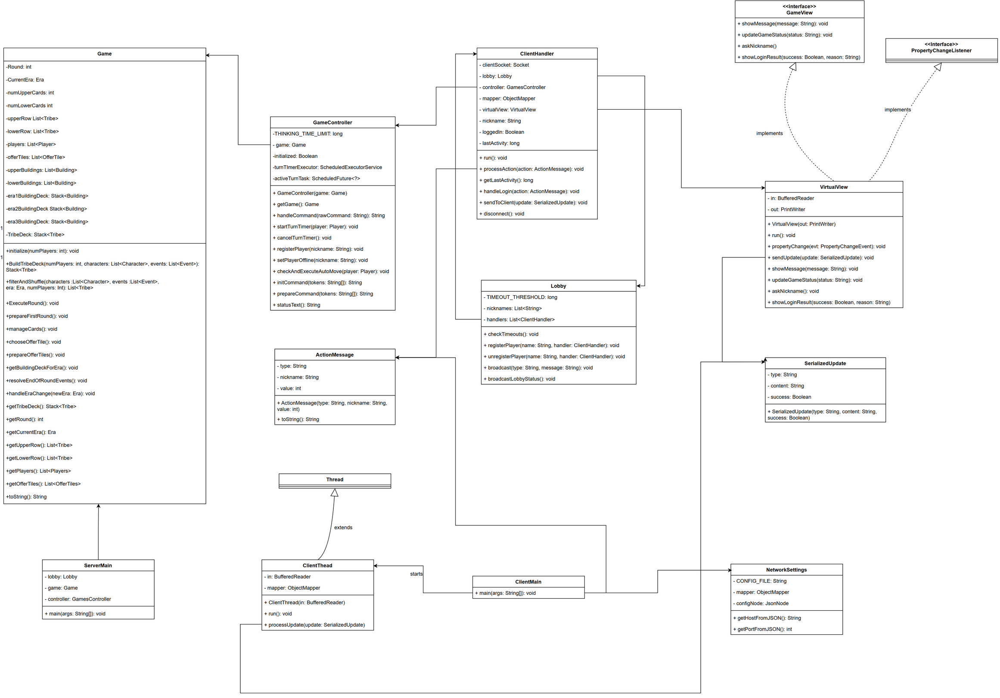
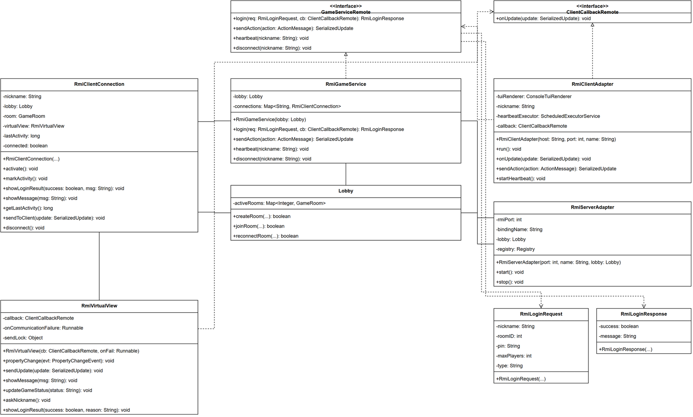
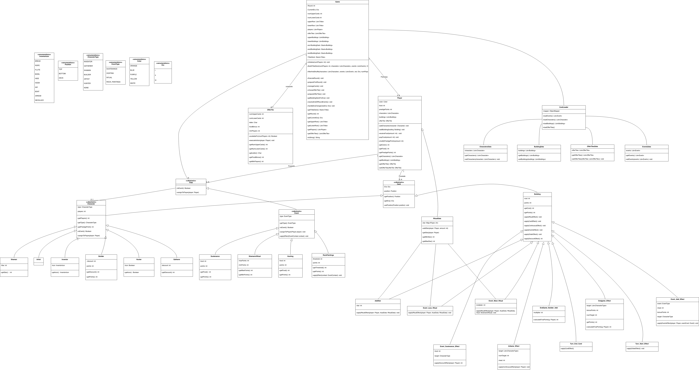

# ing-sw-2026-cheng-wu-xu-zhang

###  Server
The server handles both **TCP Socket** and **RMI** connections simultaneously by default, and acts as the manager for game rooms.

To start the server, run the `ServerMain` class:
* **Without arguments**: Starts both Socket and RMI using the ports specified in `network_config.json`.
* **With arguments**: `java -jar Server.jar socket 9999` or `java -jar Server.jar rmi 1099` to force startup with a single protocol.

---

###  GUI Client (JavaFX)
The graphical client has a two-screen flow (Connection -> Gateway Menu).

To start the GUI, run the `Launcher` class.
At startup, the user will be asked to enter the server IP, port, and protocol (Socket/RMI).
Then, through the **Gateway Menu**, the user can choose whether to **create, join, or reconnect** to a game.
Before the match starts, players mark themselves as **Ready**. The match setup advances automatically when all required players are ready; there is no manual "Start Game" step.
The pre-start screen also includes:
* **Remove Ready**: removes the local player's ready state before color selection begins.
* **Back to Lobby**: returns to the create/join/reconnect menu and clears the local ready state first.

---

###  CLI Client (Text-Based)
To play from the terminal, run the `ClientMain` class (Socket) or `RmiClientAdapter` (RMI).
The text-based client first asks for the network parameters, then shows an interactive menu for identity management (nickname, Room ID, PIN) to interact with the server.
Useful TUI commands include `ready`, `unready`, `color <name>`, `status`, `hand`, `totem <letter>`, and `pick <upper|lower> <t|b> <index>`.
The `hand` command requests the local player's character and building cards from the server.

---

##  Gameplay Notes

### Lobby and match start

Rooms use the player count selected at creation time.
Each connected player must send `ready`; once the required ready count is reached, the game automatically moves to color selection in ready order.
After every ready player has chosen a color, the match starts.

### GUI feedback

The GUI keeps the turn-order tile visible in the side panel. Hovering over it hides the player tokens so the tile itself can be inspected without changing its size.

During event resolution, the GUI shows event and calculation popups one at a time. These popups require pressing **Next** before continuing to the next event message.
For example, Sustenance calculations show the food requirement, Gatherer/building discounts, paid food, missing food, unfed characters, and resulting prestige-point change for each player.

---

##  Code Structure

The project was developed following the **Distributed MVC (Model-View-Controller)** pattern to ensure full decoupling between the game logic and the network layer.

* **Model (`it.polimi.Game.Core.Game`)**: Contains the pure game state, card decks, player resources, and Era progression logic. It has no network dependency and communicates state changes through `PropertyChangeSupport` (Observer Pattern).
* **Controller (`it.polimi.Game.Core.GameController`)**: Acts as a State Machine. It receives command strings, checks whether each move is legal, applies it to the Model, and manages turn timers.
* **Virtual View (`it.polimi.Network.Server.View.VirtualView`)**: Lives on the server. To the Controller it appears as a local View, but internally it serializes game state updates to JSON (through the Jackson library) or native callbacks and sends them to remote clients through Socket/RMI.

---

##  UML
- [Network Architecture Diagram](./ControllerNetworkUML.drawio)

RMI

- [Model Class Diagram](./FinalModelUML.drawio)



---

##  Additional Features (Advanced Requirements)

In addition to the basic game rules, the following advanced features (FA) have been implemented:

1.  **Multiple Games (FA 1)**
    * The server does not host a single global game, but a `Lobby` manager that acts as a router.
    * Players can create new **isolated rooms** (`GameRoom` abstraction) by defining the maximum number of players, or join existing rooms through a Room ID.

2.  **Disconnection Resilience and Secure Reconnection (FA 2)**
    * Clients implement an asynchronous **Heartbeat** system. If the server does not receive messages from a client for more than 20 seconds, it disconnects that client.
    * The offline player remains registered inside the `GameRoom`.
    * By using a **secret PIN** chosen when creating or joining the room, the player can securely reconnect to the exact game session through the GUI/CLI "RECONNECT" tab.
    * While at least two players remain online, offline players are handled by the automatic-move logic when their turn is reached.
    * If only one player remains online, the match is suspended and game actions are blocked while waiting for another player to reconnect.
    * If a second player reconnects, the pending timeout is cancelled and the match resumes from the interrupted phase.
    * If nobody reconnects within 120 seconds, the sole online player is declared the winner and the match ends.

---

##  MySQL — Match Score Persistence

The server can automatically save the final scores of each match to a MySQL database.
Writing happens at the end of the game, when the Controller calculates final scores and determines the winners.

### Enabling and configuration

By default, it is **enabled** and uses the values defined in `db_config.json` (resources).

To connect the server to your own MySQL instance, edit:

`Mesos/src/main/resources/db_config.json`

Replace the database address and credentials with the values for your installation:

```json
{
  "enabled": true,
  "host": "YOUR_DATABASE_HOST_OR_IP",
  "port": 3306,
  "db": "YOUR_DATABASE_NAME",
  "user": "YOUR_DATABASE_USER",
  "password": "YOUR_DATABASE_PASSWORD",
  "adminUser": "YOUR_ADMIN_USER",
  "adminPassword": "YOUR_ADMIN_PASSWORD",
  "table": "mesos_game_scores",
  "autoCreate": true,
  "connectTimeoutMs": 10000,
  "socketTimeoutMs": 30000
}
```

The `host` field must contain the IP address or hostname of the machine running MySQL. Use `127.0.0.1` when MySQL runs on the same machine as the server. The configured users must have permission to connect to the selected database; when `autoCreate` is enabled, the administrative user must also be able to create the database and tables.

Do not commit real production passwords. Environment variables or JVM properties can override the values stored in the file and should be preferred for shared or public repositories.

To disable it:

- `MESOS_DB_ENABLED=false` or `-Dmesos.db.enabled=false`

Alternatively, set `"enabled": false` in `db_config.json`.

Note: during `mvn test`, it is disabled automatically.

Supported parameters (environment variables / JVM properties):

- `MESOS_DB_URL` / `mesos.db.url` (highest priority)
- `MESOS_DB_HOST` / `mesos.db.host` (default: as defined in `db_config.json`)
- `MESOS_DB_PORT` / `mesos.db.port` (default: as defined in `db_config.json`)
- `MESOS_DB_NAME` / `mesos.db.name` (default: as defined in `db_config.json`)
- `MESOS_DB_USER` / `mesos.db.user` (default: as defined in `db_config.json`)
- `MESOS_DB_PASSWORD` / `mesos.db.password` (default: as defined in `db_config.json`)
- `MESOS_DB_TABLE` / `mesos.db.table` (default: as defined in `db_config.json`)
- `MESOS_DB_AUTOCREATE` / `mesos.db.autocreate` (default: as defined in `db_config.json`)


### Table schema

If `MESOS_DB_AUTOCREATE=true`, the server tries to create the table automatically (requires `CREATE` privileges).
Alternatively, run it manually:

```sql
CREATE TABLE IF NOT EXISTS mesos_game_scores (
    match_id CHAR(36) NOT NULL,
    ended_at TIMESTAMP NOT NULL,
    player_nickname VARCHAR(64) NOT NULL,
    prestige_points INT NOT NULL,
    food INT NOT NULL,
    endgame_bonus INT NOT NULL,
    player_rank INT NOT NULL,
    is_winner BOOLEAN NOT NULL,
    PRIMARY KEY (match_id, player_nickname),
    INDEX idx_ended_at (ended_at)
);

CREATE TABLE IF NOT EXISTS mesos_game_scores_reports (
    match_id CHAR(36) NOT NULL,
    ended_at TIMESTAMP NOT NULL,
    final_report TEXT NOT NULL,
    PRIMARY KEY (match_id),
    INDEX idx_ended_at (ended_at)
);
```

### Quick check (debug)

1) Start the **server** (DB enabled by default).

2) When a room/game is created (GameRoom/Controller), the server prints a line similar to:

```
[DB] MySQL score persistence ENABLED url=... user=... table=... autoCreate=... passwordSet=true
```

If it does not appear, either the DB has been disabled (`MESOS_DB_ENABLED=false` / `-Dmesos.db.enabled=false`) or no game has been created yet.

3) Finish a game: writing happens **only at the end of the game**. If the insert succeeds, you will see:

```
[DB] Saved match scores matchId=... players=... table=...
```

4) Check from the DB:

```sql
SELECT COUNT(*) FROM mesos_game_scores;
SELECT * FROM mesos_game_scores ORDER BY ended_at DESC LIMIT 20;
```
